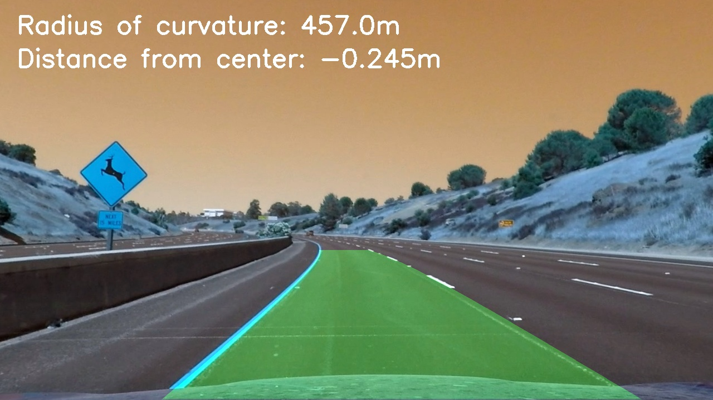

## Advanced Lane Finding

## How I Built It

I've created a tutorial like walkthrough on the pipeline notebook itself you can follow with accompanying code and output to see how it's built step by step. Those steps can be summed up as follow:

* Calibrate our camera lens using chessboard images also shot with the camera
* Use our calibration numbers to undistort our image/video of the road shot on that camera
* Get a top down view of the road so we have a nice 2D image of the lane lines 
* Use saturation and sobel x gradient values as thresholds to detect lane lines in a binary image
* Use a window-sliding algorithm to get the exact x,y values of the line and calculate the equation of the line
* With the equation of the line we can get the curve of the lane and our position in the lane from center
* Show a visual of the lane boundaries and numerical estimation of lane curvature and vehicle position.

The main flaw of this pipeline is speed. Despite using a class to make sure the most expensive function find_lane_pixels() is only run on the first frame the pipeline sees, the pipeline is still slow to write the output video. The pipeline also has a week spot for large dark spots. Extended tree shadows and long patches of new ashphalt in the lane can cause blips of miscalculations you can see well in the challenge_video_output. Further threshold calibrating could help though smoothing and averaging the changes in the fit of the line over time may be more effective/robust.